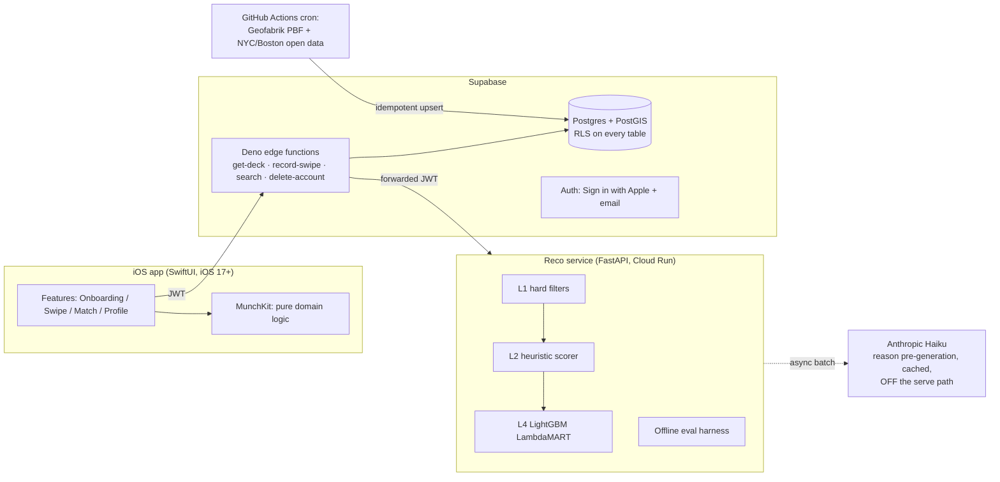

# Munch — Architecture

> Phase 0 version: structure and contracts. Diagrams gain detail as phases land.

## System overview

## Load-bearing decisions (full rationale in DECISIONS.md)

1. **Windows-author / macOS-CI split.** All code is plain text authorable on
   Windows; XcodeGen generates the Xcode project in CI. Pure logic lives in
   MunchKit so the inner test loop never needs a Mac.
2. **Serving never calls an external data API.** Restaurants are seeded from
   open data into Postgres; a user request touches only Munch infrastructure.
   This is what makes the demo free to run indefinitely.
3. **The LLM is off the serve path.** Decks serve instantly from the ranker
   with cached/templated reasons; Haiku pre-generates reason text
   asynchronously. A missing Anthropic key is a supported configuration.
4. **The reco service is a separate process** (FastAPI on Cloud Run) because
   ML dependencies (LightGBM) and the eval harness don't belong in the Deno
   edge runtime. It authenticates callers by verifying Supabase JWTs.
5. **RLS is enabled in the same migration that creates each table.** Supabase
   exposes every public-schema table via PostgREST to anon-key holders, and
   the anon key ships inside the IPA. No exceptions, verified by pgTAP.

## Request flow: "give me a deck" (Phase 3, live — Firebase edition, D-019)

1. iOS calls `POST /v1/deck` on the Munch API (Cloud Run) with its Firebase ID
   token + mode + location. The client NEVER talks to Firestore directly —
   that is the portability seam, and why `firestore.rules` is deny-all.
2. The API verifies the token (TokenVerifier port → firebase_admin) and loads
   the profile (ProfileStore port).
3. VenueRepository port retrieves candidates: geohash range queries + exact
   haversine post-filter (Firestore adapter) — or one ST_DWithin on a future
   Postgres adapter; the API can't tell the difference.
4. Deck assembly: L1 hard filters → L2 heuristic scoring with a Thompson draw
   on the quality term → per-cuisine cap → 2 explore slots (D-009), each card
   with a templated reason (LLM-cached reasons arrive in Phase 5, D-004).
5. The served deck is logged to `reco_events` with explore flags — the
   training log (D-008) — and returned. iOS pre-fetches the next deck so a
   swipe never waits on the network.

## Repo layout

See README.md's repository map. Every directory has a purpose comment at the
top of its primary file.
